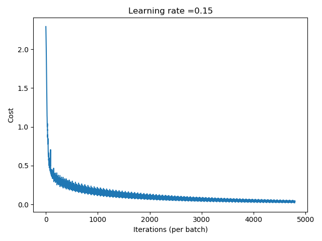
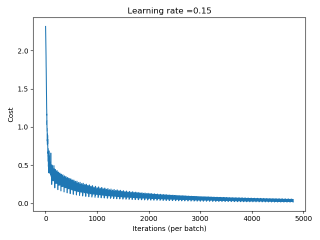
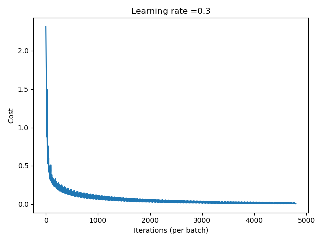
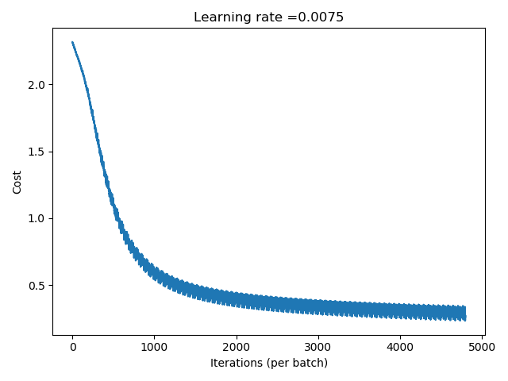
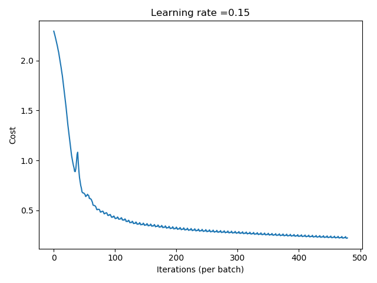
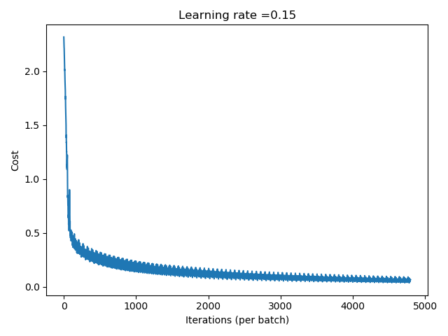
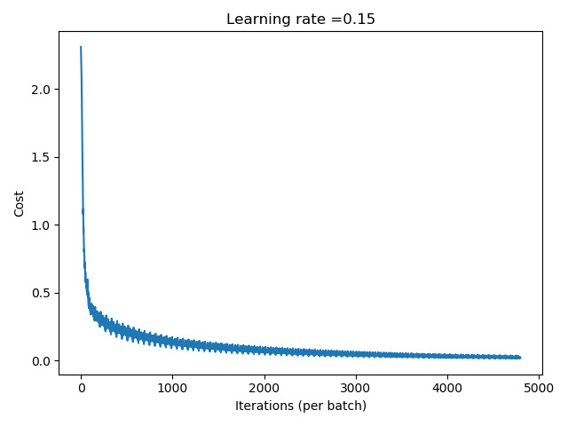

# MNIST数据集以及多层神经网络调参实现心得

MNIST为经典数字识别数据集，用它来入门计算机视觉以及深度学习再合适不过了

手动实现神经网络真的好麻烦啊！！！不过可以帮助我理解更多神经网络的细节，拓展思路

## 文件内容

- data/ 原始MNIST数据

- train_images/ 训练集.jpg

- test_images/ 测试集.jpg

- DNN.py 模型主文件

- dnn_utils.py relu sigmoid softmax之类的激活函数，及其反向函数

- Loader.py 加载数据集文件

- Save.py 用于将原始数据集转成JPG

## MNIST数据集

图片大小28*28=784

训练集60000张

测试集10000张

使用Loader.py里的load_dataset()可以加载图片

- train_x  (784,60000)
- test_y   (1,60000)
- train_x  (784,10000)
- test_y   (1,10000)
- classes  10

## 模型结构

10分类问题

图片要标准化成[0,1]，所以需要除以255

先将y展开成one-hot形式

(3层神经网络)784-64-32-10(Softmax)

## 实验结果

目前最好的实验结果是：

训练集99.11%

测试集97.43%

显然过拟合，不过没关系，就不正则化了

## 可调参数

- 随机打乱数据集（防止分布出问题，到后期震荡太大）

- HU(64,32)

- mini-batch的batch_size，我设为了1000

- 学习率 0.15

- 迭代次数 80*60000/1000=4800

最好结果

不随机打乱，下面疯狂震荡，不过还好

学习率 0.3

train-99.83% / test-97.65%

学习率 0.0075

batch_size 10000

HU(32,16)

train-98.225% / test-96.73%

HU(128,64)

train-99.59% / test-97.83%

## 总结

综上所述，batch_size和学习率还有HU比较有用吧可能，主要还是学习率